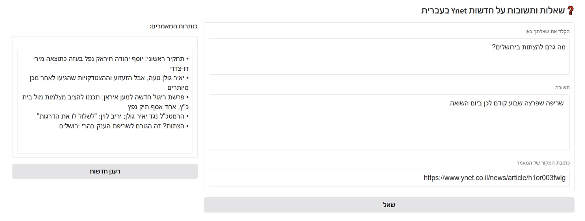
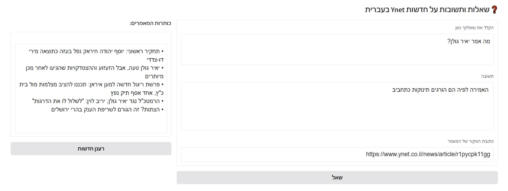

# Ynet_QA_RAG_ChatBot

A Hebrew-language chatbot that scrapes news from Ynet, indexes them using embeddings, and answers user questions using state-of-the-art natural language processing models. The app is built with Python and Gradio, using LangChain for information retrieval and HuggingFace for language models.

## 🚀 Project Features

- 🔄 **Live RSS Scraping** from Ynet
- 🧠 **Hebrew Embedding Model** (`avichr/heBERT`)
- 🤖 **Multilingual Question Answering Model** (`xlm-roberta-large-squad2`)
- 🔍 **Semantic Search** using FAISS
- 🧩 **LangChain Integration** for Document Splitting, Vectorization, enabling efficient chunking, embedding, and retrieval.
- 🌐 **Interactive Web Interface** using Gradio
- 🔁 **One-Click News Refresh** Button

## 📦 Technologies Used

| Tool/Library              | Purpose |
|--------------------------|---------|
| `Gradio`                 | Interactive web UI |
| `requests`, `bs4`        | Web scraping |
| `xml.etree.ElementTree` | RSS feed parsing |
| `langchain`              | Document processing & vector storage |
| `FAISS`                  | Efficient similarity search |
| `HuggingFace Transformers` | Embedding & QA pipeline |

## 🖥️ How to Run
There are two ways you can run this project:

Using Google Colab (Recommended for easy setup) Download the notebook:

Visit the GitHub repository and download the Ynet_QA_RAG_ChatBot.ipynb file. Upload the notebook to Colab:

Open Google Colab. Click on "File" > "Upload notebook" and select the downloaded .ipynb file.

Clone this repository:

git clone https://github.com/NassiDudi/Ynet_QA_RAG_ChatBot.git
Install the required packages

## 🧠 Architecture Overview
**These models were chosen because they are freely accessible(without payment), easy to integrate, and perform reasonably well for Hebrew, which lacks the extensive NLP support available for English.**
This is a proof-of-concept (PoC) project demonstrating how you can build a **Hebrew-language news QA** chatbot using **only free models** and open-source tools. However:

-**English QA models** generally perform better due to greater training data and broader model support.

-**Paid models** (like OpenAI's GPT-4, Cohere's command R+, or commercial BERT variants) can offer much higher accuracy, more fluent answers, and better reasoning capabilities.

### 1. **Scraping & Preprocessing**
The function `scrape_articles_from_rss` uses Ynet's RSS feed to extract article titles and URLs. Each article is scraped with `requests` and parsed with `BeautifulSoup`.
Only articles longer than 200 characters are retained for semantic relevance.

### 2. **Text Preprocessing & Chunking** *(LangChain)*

```python
splitter = RecursiveCharacterTextSplitter(chunk_size=500, chunk_overlap=100)
split_docs = splitter.split_documents(docs)
```

After scraping, raw article content is split into smaller chunks before vectorization.

**Why Chunking?**

- Large language models (LLMs) have a token limit (e.g., ~512-4096 tokens).
- Sending full documents to the model may be inefficient or even impossible.
- Smaller, overlapping chunks allow better **semantic granularity** and **context continuity**.

**LangChain Tool Used:**
- `RecursiveCharacterTextSplitter` is part of LangChain’s document preprocessing pipeline.
- It recursively splits documents by:
  - Paragraph → Sentence → Word → Character (in order of preference)
- This recursive approach avoids cutting off semantic units (e.g., sentences in the middle), preserving natural language flow.

**Parameters:**
- `chunk_size=500`: Each chunk will not exceed 500 characters.
- `chunk_overlap=100`: A 100-character overlap is preserved between chunks to retain context across boundaries. This is important when questions may relate to information on the boundary of two chunks.

---

### 3. **Vectorization & Semantic Indexing**

```python
embedding_model = HuggingFaceEmbeddings(model_name="avichr/heBERT")
vectorstore = FAISS.from_documents(split_docs, embedding_model)
```

This step converts chunks into dense numerical vectors that represent their semantic meaning.

#### 🔹 **Why Use Embeddings?**

- **Goal:** Enable similarity search based on **meaning**, not just keywords.
- Embeddings convert each chunk into a fixed-length vector in a high-dimensional space.
- Similar vectors (in cosine or Euclidean space) represent semantically similar chunks, even if they use different vocabulary.

#### 🔹 **Model Chosen: `avichr/heBERT`**

- A **Hebrew-specific Sentence-BERT** model.
- Trained on a wide variety of Hebrew text sources.
- Produces contextualized sentence-level embeddings tailored to Hebrew syntax and semantics.
- Provided via `HuggingFaceEmbeddings` (LangChain wrapper over `sentence-transformers` interface).

#### 🔹 **FAISS Vector Store**

- **FAISS (Facebook AI Similarity Search)** is a fast and scalable library for nearest neighbor search.
- LangChain integrates directly with FAISS using `FAISS.from_documents`.
- Internally, it stores the embeddings of each document chunk and enables fast top-k similarity retrieval.

**Why FAISS?**

- Efficient for high-dimensional vector operations.
- Ideal for real-time or near-real-time document retrieval.
- Scalable to large corpora with minimal latency.

---

### 4. **Question Answering (QA) Pipeline**

```python
qa_pipe = pipeline("question-answering", model="xlm-roberta-large-squad2")
```

- A multilingual extractive QA pipeline built on **Hugging Face Transformers**.
- Uses `xlm-roberta-large-squad2`, a cross-lingual version of RoBERTa trained on SQuAD v2.

**Why This Model?**

- Capable of handling both Hebrew and English input, although optimized for multilingual performance.
- Given a context and a question, it returns the most probable **text span** in the context as the answer.

---

### 5. **Semantic Retrieval + QA Answering**

```python
vectorstore.similarity_search(query, k=1)
qa_pipe({"question": query, "context": top_chunk})
```

- When a user submits a question, the vectorstore retrieves the most semantically relevant chunk (`k=1`) using similarity search.
- The best chunk is sent to the QA pipeline along with the user’s question.
- The pipeline returns an extractive answer from that chunk.

---

### 6. **Interactive Frontend (Gradio)**

- Built using [Gradio](https://gradio.app/), a lightweight Python library for rapid deployment of ML models.
- Allows users to:
  - See current news titles.
  - Ask questions in Hebrew.
  - View the answer and article URL.
  - Click a **Refresh** button to re-scrape the latest news and rebuild the vector index.


## 📌 Notes

- Only the **top 5** articles(from Ynet Homepage) are indexed to keep performance optimal.
- If the scraped article contains `ld+json` data with `articleBody`, it is preferred over raw HTML parsing.
- FAISS is stored in memory and rebuilt every time the app is refreshed.
- Currently uses `xlm-roberta-large-squad2` because it's one of the best available models for multilingual QA.
- The project uses the avichr/heBERT embedding model and the xlm-roberta-large-squad2 QA model because:
  
    ✅ Both models are freely available via Hugging Face
    🧠 heBERT is a high-quality Hebrew sentence embedding model
    🌍 xlm-roberta-large-squad2 is one of the best multilingual models for QA, supporting Hebrew and many other languages

## 🧪 Example Use

📝 Note: Questions should be based on the topics covered in the article titles, as only those articles are indexed and processed.

Ask:
> "מה גרם להצתות בירושלים"

The model will:
- Search for the most relevant article chunk
- Extract the best short answer
- Return both the answer and the source link

## 🖼️ Example Screenshots


